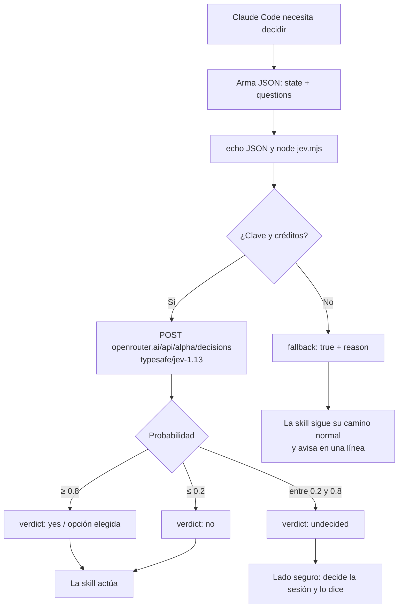

<div align="center">

# jev-openrouter

**Decisiones baratas y estructuradas para Claude Code, usando Jev vía OpenRouter.**

Clasifica, filtra y rutea sin gastar tokens del modelo principal en cada decisión.

[](LICENSE)
[](https://nodejs.org)
[](package.json)
[](https://openrouter.ai/typesafe/jev-1.13)

</div>

---

## Qué es

Jev es el modelo de decisiones de TypeSafe AI. No razona ni escribe texto libre: responde con una **opción elegida** (`choice`) o un **sí/no con probabilidad** (`noul`). Eso lo hace barato y predecible para decidir cosas como "¿es urgente?" o "¿qué equipo lo atiende?".

Este cliente lo llama a través de la API de OpenRouter y lo deja listo para usar como skill de Claude Code.

> Este proyecto no está afiliado a TypeSafe ni a OpenRouter.

## Flujo



Si algo falla (sin clave, sin créditos, red, error de OpenRouter o JSON inválido), el script **no se cae**: devuelve `fallback: true` con el motivo y sale con código 0. La skill nunca se bloquea por falta de créditos.

## Contenido

| Ruta | Qué es |
|---|---|
| `skills/jev/scripts/jev.mjs` | Cliente sin dependencias. JSON por stdin, veredictos por stdout. |
| `skills/jev/SKILL.md` | La skill para Claude Code: formato de preguntas y lectura de respuestas. |
| `test/jev.test.mjs` | 9 pruebas sin red, con un `fetch` falso. |

Primitivas soportadas: `choice` y `noul`.

## Instalación

```bash
mkdir -p ~/.claude/skills
cp -r skills/jev ~/.claude/skills/jev
```

Define la clave en tu entorno. **Nunca** la pongas en el repo:

```bash
export OPENROUTER_API_KEY="tu-clave"
```

¿Ya usas `claude-or` con la clave en el Llavero de macOS? Reutilízala:

```bash
export OPENROUTER_API_KEY="$(security find-generic-password -a "$USER" -s claude-openrouter -w 2>/dev/null)"
```

## Uso

### Desde la terminal

```bash
echo '{
  "state": "Pago rechazado tres veces",
  "questions": {
    "es_urgente": { "type": "noul", "instructions": "¿Requiere atención hoy?" }
  }
}' | node skills/jev/scripts/jev.mjs
```

Con clave y créditos:

```json
{
  "model": "typesafe/jev-1.13-20260917",
  "answers": {
    "es_urgente": { "probability": 0.82, "verdict": "yes" }
  },
  "cost": 0.000011718
}
```

Sin clave, sin créditos o con error:

```json
{
  "fallback": true,
  "sin_creditos": false,
  "reason": "Falta la variable de entorno OPENROUTER_API_KEY"
}
```

### Desde Claude Code

Una vez instalada la skill, Claude la usa cuando necesita una decisión estructurada. Ejemplo de llamada que arma la skill:

```bash
node ~/.claude/skills/jev/scripts/jev.mjs <<'JSON'
{"state": "Agregar retries=3 en default_args de 40 DAGs",
 "questions": {
  "ruta": {"type": "choice", "instructions": "¿Qué tipo de trabajo es?", "criteria": {
    "datos": "Consulta o resultado en Redshift.",
    "mecanico": "Cambio repetido de bajo riesgo.",
    "criterio": "Cambio con riesgo o que requiere decidir."}}}}
JSON
```

### Como módulo

```js
import { decidir } from "./skills/jev/scripts/jev.mjs";

const r = await decidir({
  state: "Pago rechazado tres veces",
  questions: {
    es_urgente: { type: "noul", instructions: "¿Requiere atención hoy?" },
  },
});

console.log(r.answers.es_urgente.verdict); // yes | no | undecided
```

## Configuración

| Variable | Default | Qué hace |
|---|---|---|
| `OPENROUTER_API_KEY` | (obligatoria) | Clave de OpenRouter. |
| `JEV_THRESHOLD_HIGH` | `0.8` | Probabilidad mínima para `yes` o una opción. |
| `JEV_THRESHOLD_LOW` | `0.2` | Probabilidad máxima para `no`. |

## Costo

Una pregunta `noul` corta costó **USD 0.0000117**, y dos preguntas (`choice` + `noul`) costaron **USD 0.0000213**. Con 10 USD tienes cientos de miles de decisiones de este tipo. El costo real depende del largo del `state` y del número de preguntas, y viene en el campo `cost`.

## Cómo lo usa `elegir-skill`

Un caso real de uso: una skill que decide qué flujo corre para una tarea de código. Antes de proponer, consulta a Jev con dos preguntas en una sola llamada:

| Pregunta | Tipo | Veredicto | Resultado |
|---|---|---|---|
| `ruta` | `choice` | `datos` | Flujo de datos, sin código. |
| `ruta` | `choice` | `mecanico` | Cambio repetido de bajo riesgo: flujo barato. |
| `ruta` | `choice` | `criterio` o `undecided` | Flujo con criterio. |
| `requiere_diseno` | `noul` | `no` | Sin etapa de diseño con Opus. |
| `requiere_diseno` | `noul` | `yes` o `undecided` | Cadena completa con diseño. |
| (fallback) | | | Decide la sesión principal y avisa. |

Reglas de seguridad:
- Jev **no** decide despliegues, borrados, cobros ni cambios de datos en producción. Esos casos siempre van con revisión.
- Jev solo propone la ruta; no ejecuta nada.
- Ante la duda, el lado seguro: `undecided` no ahorra, pero no se equivoca en lo caro.

## Pruebas

```bash
npm test
```

Las pruebas no hacen llamadas reales. Cubren umbrales, construcción del JSON, normalización de respuestas, manejo de errores y el fallback del CLI.

## Limitaciones

- Jev no razona ni explica. Valida los umbrales con tus propios datos antes de confiar en ellos.
- Ventana de contexto: 32.000 tokens entre `state` y preguntas.
- Decisiones de alto impacto (cobros, borrados, despliegues) necesitan validación aparte.

## Licencia

MIT. Ver [LICENSE](LICENSE).
